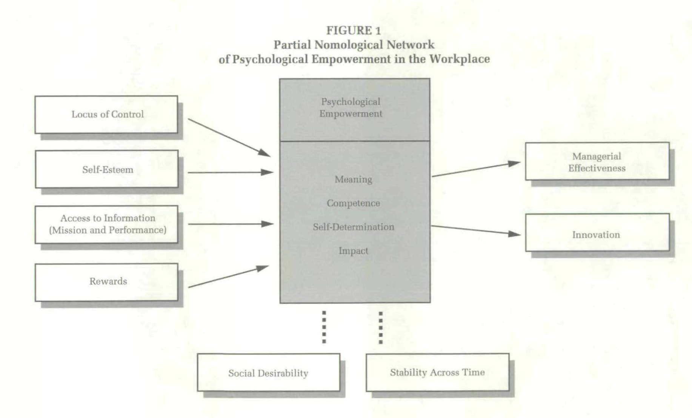

# 1995 Spreitzer PSYCHOLOGICAL EMPOWERMENT IN THE WORKPLACE: DIMENSIONS, MEASUREMENT, AND VALIDATION

## Metadata

- Item Type: [[Article]]
- Authors: [[Gretchen M Spreitzer]]
- Date: [[1995]]
- Date Added: [[2022-02-15]]
- Cite key: spreitzer1995
- Topics: [[intrapreneurship-research]] #literature-notes
- PDF Attachments
  - [Spreitzer - PSYCHOLOGICAL EMPOWERMENT IN THE WORKPLACE DIMENS.pdf](zotero://open-pdf/library/items/N2CDRN4G)
- Fleeting note: [[spreitzer1995]]

## Summary

[[Gretchen Spreitzer]] successfully developed a congruent and valid construct for Psychological Empowerment. Following the argument of [[Thomas]] and [[Velthouse]] that empowerment is a multifaceted concept, it uses the four cognitions of _meaning_, _competence_, _self-determination_, and _impact_ [@spreitzer1995, p. 1443]. As such empowerment is defined as a motivational construct that reflect an a tive orientation to a work role [@spreitzer1995, p. 1444]. [[Gretchen Spreitzer]] describes _active orientation_ as the way an individual wishes and feels able to shape his or her work role and context [@spreitzer1995, p. 1445].

Spreitzer provides a partial [[nomological network]] that serves as the representation for the construct of psychological empowerment.

## Key Ideas

### Empowerment is multifaceted

Empowerment is a sum of four cognitions. Meaning, competence, self-determination, and impact all play a role in empowerment.

### Meaning is about individuals acceptance

Am I able as an individual to valye the work goal or purpose in comparison with my personal ideals or standards (Thomas & Velthouse, 1990, [@spreitzer1995, p. 1444]).

### Competence is about the belief I can do it

An individuals belief in his or her capability to perform activities with skill (Gist, 1987, [@spreitzer1995, p. 1444]). In this context it is specifically about competence towards a specific work role rather then a global competence.

### Self-determination describes having choice

The idea of an individual that one is having the choice to intiate and control actions. It is about having the autonomy to start and continue work behaviours and processes [@spretizer1995, p. 1444].

### Impact describes the influence on outcome

The degree to which an individual can influence outcomes at work. It is the opposite of helplessness [@spretizer1995, p. 1444].

### Empowerment contributes to an active orientation to a work role

The four congitions contribute to an orientation in wich an individual whishes and feels able to shape his or her work role and context [@spreitzer1995, p. 1445]. In other words, I want to and feel I am able to change my work or the environment I work in.

### Empowerment is not a dichotomy

Empowerement is not a switch you can turn on or off. Rather empowerment is a scale, that is shaped by the work environment [@spreitzer1995, p. 1445]. As such the work environment is expected to have an influence on level of empowerment an individual has.

### Personality traits and work context variables as antecedents of empowerment

The personality traits self-esteem and locus of control are seen as antecedents of empowerment. Both they shape the individuals perspective in their work role [@spreitzer1995, p. 1448].
The work context variables are a set of management practices concerning information sharing and structure of rewards.

### Self-esteem and locus of control are personality-trait antecedents of empowerment

How people see themselves in relation to their work environments are expected to have influence on the empowerment of an individual.

Self-esteem has found to have a positive influence. When an individual has a better perception of him or herself that would lead to perceiving themselves as more valuable and as such are likely to be more active in their work orientation [@spreitzer1995, p. 1448].

Support for the relation between locus of control is not found in this research [@spreitzer1995, p. 1458]. Locus of control describes the level of a person has own control of what happens in their life, rather then external forces [@spreitzer1995, p. 1448].

### Management practices that act as antecedents of empowerment

In order to be empowering as organisation it is essential that information needs to be more available to more people on more devices (Kanter, @spreitzer1995, p. 1449). Two specific types of information are critical for empowerment:

1. information about an organisation's mission
2. information about performance

Next to information sharing a reward systems needs to be in place that recognises individual contributions.

The study found that all these antecedents positively contribute to empowerment.

### Empowerment has a postive effect on managerial effectiveness and innovative behaviour

Managerial effectiveness is defined as the degree to which a manager fulfulls or exceeds work role expectations [@spreitzer1995, p. 1450]. In other words an empowered manager will perform according or above expectations.

Innovative behaviours reflect the creation of something new or different. By definition they are change-oriented [@spreitzer1995, p. 1451].

The article proved a moderate effect on empowerment and the effect on managerial effectiveness and innovative behaviour.
